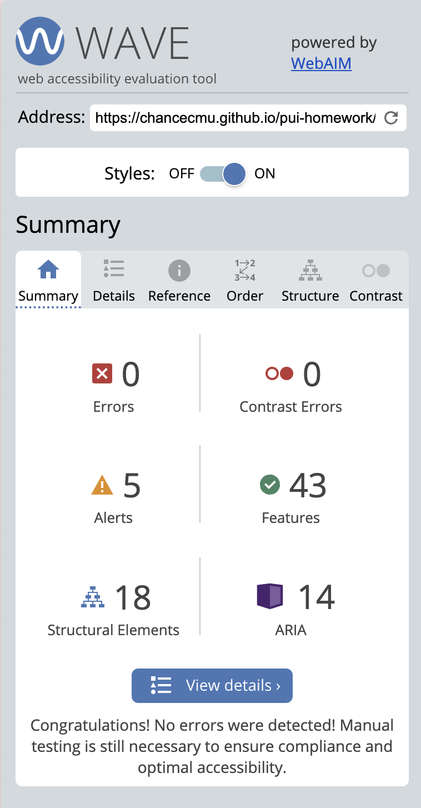
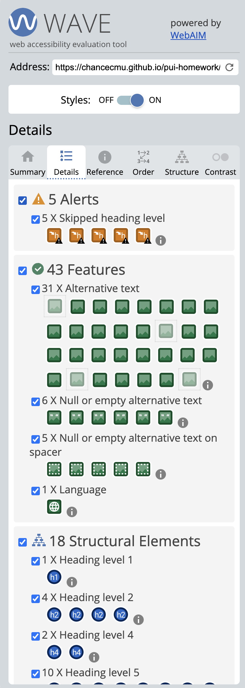
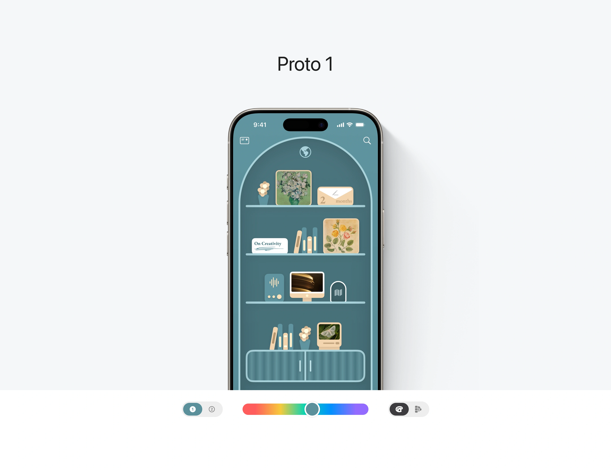
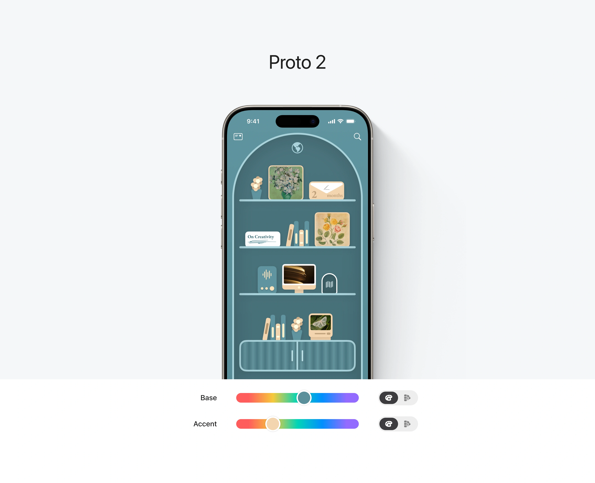
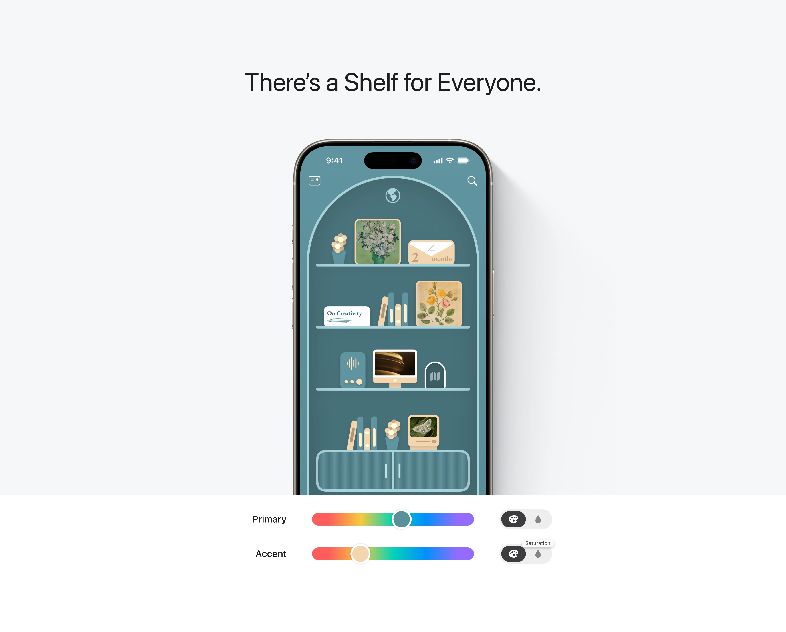
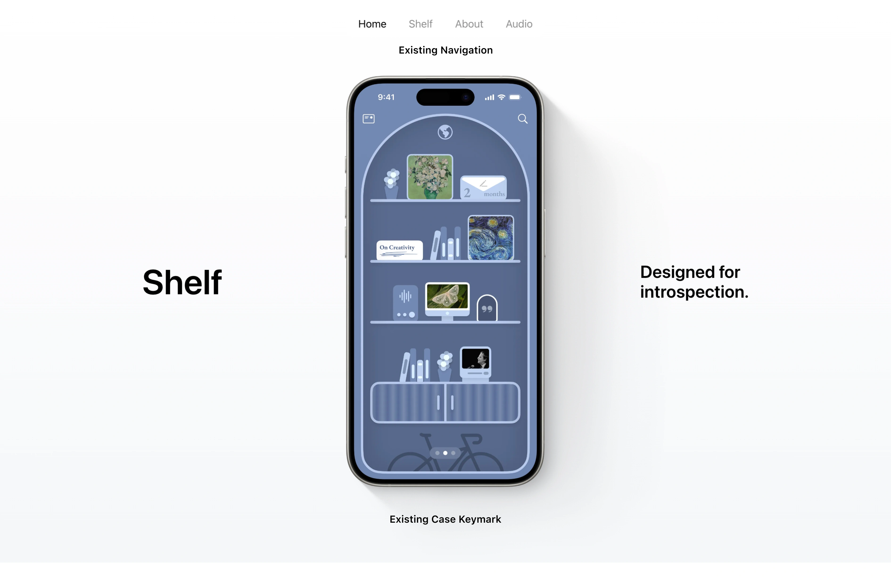
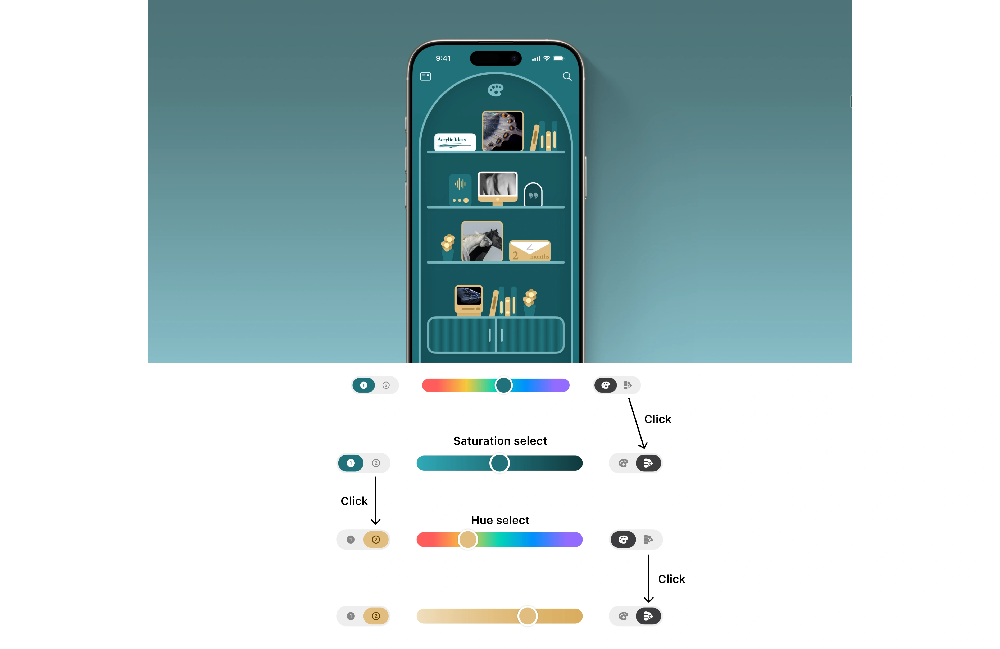
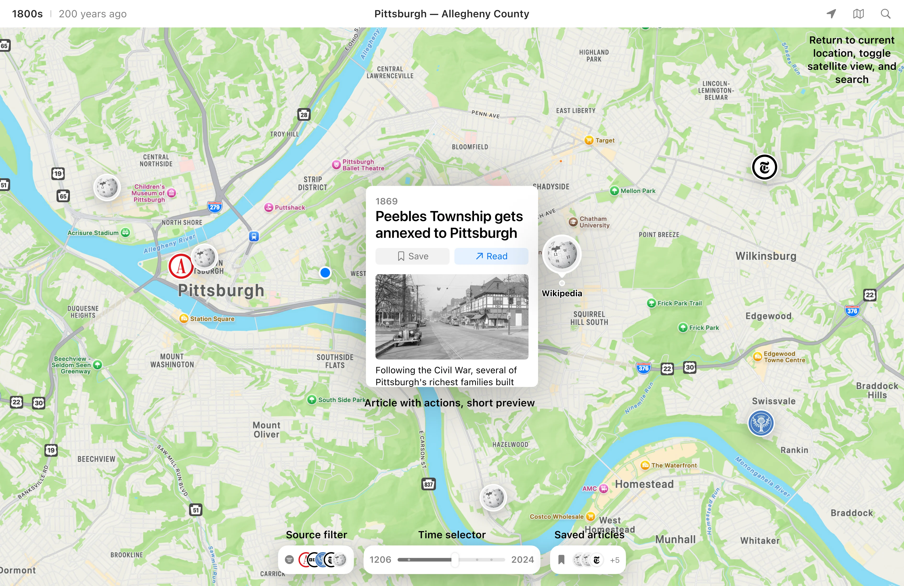

---

# **FP4 \- Final Project Writeup**

Feel free to refer to this [Markdown Cheat Sheet](https://www.markdownguide.org/cheat-sheet/) to make your writeup more organized, and you can preview your markdown file in VSCode [Markdown editing with Visual Studio Code](https://code.visualstudio.com/docs/languages/markdown#_markdown-preview). 

## Part 1: Website Description

Describe your website (300 words).

* **What is the purpose of your website?**
  The purpose of my website is to showcase the functional components of a case study called *Shelf*. It highlights my design thinking and visual design skills, aimed at engaging both prospective users of *Shelf* and hiring managers evaluating my expertise.

* **Who is the target audience?**
  The target audience includes potential *Shelf* users and hiring managers interested in assessing my capabilities in visual design and case study presentation.

* **What information do you convey with your website?**
  The website demonstrates the key functional screens of the *Shelf* project in an interactive and engaging format. Instead of static visuals, it incorporates animations and interactions to provide a dynamic exploration of the design. It also conveys my skills in visual design in the specific way that I've designed the case study. I wish to convey an approaching mastery of the Apple aesthetic, given that I seek to work in Apple's Human Interface Team (proficiency in their design aesthetic is a must in their applications for this role).

* **How is it interesting and engaging?**
  It uses interactive features, such as an onboarding tour with animations and an artifact showcase with interactive item filters. Additionally, a color picker tool allows users to explore color palettes, emphasizing the expressive potential of the *Shelf* project through both a project design and case study visual communication lens.

* **Note:**
  This website only includes the functional portions of this case study so a lot of background and static portions are excluded. Please evaluate each section as standalone sections not the overall cohesiveness. CSS implementations explored a new nesting technique which was not taught. I found it online, and it managed to simplify my CSS to be more readable for me. 
## Part 2: User Interaction

How a user would interact with your website? For each step, briefly but clearly state the interaction type & how we should reproduce it.

1. **Reading Section**: Users scroll through the initial section, which provides a brief introduction about the case study.
2. **Interactive Tour**: Users click left and right chevrons to navigate the onboarding process. A restart button is available to return to the beginning of the tour.
3. **Artifact Showcase**: Users can:
   - Navigate through images using chevrons.
   - Click on group filters (Notes, Photos, Links, Voice Memos) to focus on specific group of designed artifacts.
4. **Time Capsule**: Users navigate one screen at a time, showcasing workflow screens sequentially.
5. **Color Picker**: Users adjust sliders to explore and create custom color palettes. This interactivity emphasizes the role of color as a tool for self-expression in the project - and showcases my interaction design proficiency.
* **Screen Sizes:**
  Test this at a 14" or 16" MacBook Pro screen size (1512 x 982; 1728 x 1117; respectively) and a portrait iPad Pro (1024 x 1366).
  I could have chosen a mobile device, but I did not have much experience designing for iPad proportions, so I wanted to learn how to do this.
* **WAVE Screenshots:**
Paste screenshots of the “Summary” and “Details” sections into the writeup, showing no errors.

## Part 3: External Tool

Describe what important external tool you used (JavaScript library, Web API, animations, or other). Following the bulleted list format below, reply to each of the prompts.

1. **Name of tool**: NoUI Slider
   - **Why did you choose to use it over other alternatives?**
     I chose NoUI Slider because it is simple, easy to implement, and fits the design requirements without adding unnecessary complexity.
   - **How did you use it?**
     I used it to create a color picker tool that allows users to explore and adjust colors intuitively, avoiding technical terminology and encouraging exploration.
   - **What does it add to your website?**
     It adds interactivity, enabling users to engage with the design process by customizing color palettes, making the experience more immersive and expressive.

## Part 4: Design Iteration

Describe how you iterated on your prototypes, if at all, including any changes you made to your original design while you were implementing your website and the rationale for the changes. (4-8 sentences max)

During implementation, I simplified the slider design to prioritize usability and accessibility. Originally, I planned to use a complex interaction model, but testing revealed that a straightforward four-slider interface was more effective. This design choice ensures clarity and reduces cognitive load, while still allowing users to explore and adjust colors in meaningful ways. I also iterated on SVG design and masking in Figma to ensure seamless integration with web-based visuals. These changes reflect a greater focus on simplicity and design feasibility.

## Part 5: Implementation Challenge

What challenges did you experience in implementing your website? (2-4 sentences max)

A major challenge was managing reusable components for the interactive sections using vanilla JavaScript. I wanted to create a unified class for animations and interactions across multiple feature sections, which required significant trial and error. I'm now left with a seemingly fragile class that I'm afraid to make updates to. Another difficulty was ensuring the exported SVGs (which was a huge design challenge and required multiple, complex masks) from Figma scaled properly and worked with HTML and CSS filters.

## Part 6: Generative AI Use and Reflection

Describe how you used Generative AI tools to create this final project (fill in the following information, write \~500 words in total).

Document your use of all GenAI tools — ChatGPT, Copilot, Claude, Cursor, etc. using the template below. Add/Delete rows or bullet points if needed, and replace Tool1/Tool2 with the name of the tool.

### Usage Experiences by Project Aspects

Feel free to edit the column \_ (other?) or add more columns if there's any other aspect in your project you've used the GenAI tools for.

For the following aspects of your project, edit the corresponding table cell to answer:
- *Usage*: Whether you used / did not use this tool for the aspect. Enter [Yes/No]
- *Productivity*: Give a rating on whether this tool makes your productivity for X aspect [1-Much Reduced, 2-Reduced, 3-Slightly Reduced, 4-Not Reduced nor Improved, 5-Slightly Improved, 6-Improved, 7-Much Improved].

| Tool Name | Ratings           | design | plan | write code | debug | _ (other?) |
|-----------|-------------------|--------|------|------------|-------|------------|
| ChatGPT   | Usage             | Yes    | No   | Yes        | Yes   | No         |
| ChatGPT   | Productivity      | 6      | N/A  | 7          | 6     | N/A        |

### Usage Reflection

> Impact on your design and plan 
* It matched my expectations and plan in [FP2](#generative-ai-use-plan) in that … For example, 
  1. **ChatGPT**: This matched my expectations and plan to use it to generate solutions for code and general debugging as well as simplifying attributions and values in CSS.
* It did not match my expectations and plan in [FP2](#generative-ai-use-plan) in that … For example, 
  1. **ChatGPT**: This did not match my expectations in just how much it understood me from my prompting. I did not expect my prompting to produce results as relevant and robust as those that were generated.
* GenAI tool did/did not influence my final design and implementation plan because … For example, 
  1. **ChatGPT**: ChatGPT influenced my implementation by simplifying complex features and organizing code for better usability. Its suggestions helped clarify and refine my color picker design, ensuring a balance between complexity and accessibility.

> Use patterns
* I accepted the generations when …  For example, 
  1. **ChatGPT**: I accepted generated code for the slider and interactive elements, modifying it for better alignment with the project goals. For example, I adapted its proposed implementation for a more intuitive color picker interface.
* I critiqued/evaluated the generated suggestions by … For example, 
  1. **ChatGPT**: I rejected generated code for the interactive elements, choosing to keep my code simple and readable. For example, I opted to keep the sliders simple and without labels (which in one user test, confused people more than help them).

> Pros and cons of using GenAI tools
  - **Pros**: Quick generation of usable code and helpful debugging support.
  - **Cons**: Limited understanding of project-specific goals, leading to overly complex initial suggestions.

### Usage Log

Document the usage logs (prompts and chat history links) for the GenAI tools you used. Some tools may not have an easy way to share usage logs, just try your best! Some instructions for different tools:

1. [ChatGPT Usage Log for Color Picker Implementation](https://chatgpt.com/share/6758be17-36ec-8004-b36d-2b8eb28abef4) 
1. I lost my chat history to all of the work I did with classes (months ago), but I believed I asked a lot of debugging questions. I knew more about this than I did the no UI slider implementation so most of this was just debugging.

---

# **FP3 \- Final Project Check-in**

Document the changes and progress of your project. How have you followed or changed your implementation & GenAI use plan and why? Remember to commit your code to save your progress.

## Implementation Plan Updates

- **Onboarding Tour**: Developed a dynamic, step-by-step interface with left/right chevron navigation and restart functionality.
- **Artifact Showcase**: Categorized artifacts for easy navigation with group selectors.
- **Color Picker**: Implemented using NoUI Slider, allowing intuitive palette customization.
- **Vanilla JavaScript Enhancements**: Incorporated animations and transitions for seamless user experiences.

## Generative AI Use Plan Updates

- Leveraged ChatGPT for:
  - Writing and debugging slider code.
  - Refining color gradient designs for the color picker.
  - Exploring efficient JavaScript class implementations for galleries and tours.
- Adjustments made for enhanced simplicity based on generated feedback and design priorities.

Remember to keep track of your prompts and usage for [FP4 writeup](#part-6-generative-ai-use-and-reflection).

---

# **FP2 \- Evaluation of the Final Project**

## Project Description

The primary motivation for this project is to showcase my design skills through a beautiful, intuitive color selector. Color plays a central role in this case study design, requiring flexibility and precise control to demonstrate a broad spectrum of choices for base and accent colors. The web portion of the project will feature an advanced color selector interface that allows users to adjust base and accent colors along two dimensions: hue and saturation. Users can switch between these dimensions using segmented controls, designed with semantic HTML and high-contrast indicators to ensure accessibility and clarity regardless of color choice.

## High-Fi Prototypes

### *Prototype 1*

Feedback highlighted that users found it difficult to understand icon meanings without contextual explanations. Many felt the layout could be clearer if both base and accent controls were displayed together.

### *Prototype 2*

Users appreciated the side-by-side view, as it allowed them to see color adjustments more intuitively. They also suggested labels like “Primary” and “Background” to denote color roles more clearly.

## Usability Test

During usability testing over video call with screen sharing, participants tested the color selector’s functions and were asked to identify regions' purposes, interpret icons, suggest improvements, and propose alternative labels for color dimensions.

**Key Feedback:**
1. **Icons for Clarity**: Participants suggested adding a tooltip or labels to improve comprehension of the icon functions.
2. **Improved Labels**: Terms like “Primary” and “Background” were preferred over “Base.”
3. **Design Interference**: The initial design was visually complex, creating a clash with the web controls.

### Design Adjustments Based on Feedback
- **Icon Clarity**: Updated icon to better represent functions like “Saturation.”
- **Side-by-Side Layout**: Implemented a side-by-side layout to allow for direct comparison of primary and accent adjustments.
- **Updated Labels**: Adopted labels such as “Primary” and “Background” to denote colors more intuitively.

This feedback inspired iterative designs, resulting in a more user-friendly and visually balanced color selector.

## Updated Designs

The updated design includes a simplified interface with intuitive icons, clear labeling, and a side-by-side layout. These adjustments enable users to better understand and manipulate colors within the selector, aligning the interface with usability needs highlighted during testing.

## Feedback Summary

Feedback during lab sessions reinforced usability testing findings, particularly regarding icon clarity and label improvements. Participants emphasized the importance of real-time color changes and supported the side-by-side slider design. Suggestions from the lab also included integrating hover tooltips to clarify icon meanings for first-time users.

### Influence on Design
- **Tooltips**: Added hover tooltips for each icon to provide immediate clarity.
- **Real-Time Interaction**: Enhanced real-time color adjustments to make changes more apparent and responsive.
- **Future Development**: Lab participants expressed interest in a feature to export custom color palettes, which inspired ideas for future iterations.

## Milestones

Outline weekly milestones to plan your expected implementation progress until the end of the semester.

### *Implementation Plan*

- [X] **Week 9 (Oct 28 \- Nov 1)**:
  - [X] FP1 due
  - [X] Finalize UI elements and refined design for dual slider functionality.
  
- [ ] **Week 10 (Nov 4 \- Nov 8)**:  
  - [ ] Draft code for dual slider functionality, and get all assets necessary finalized.

- [ ] **Week 11 (Nov 11 \- Nov 15)**:  
  - [ ] Assets imported and code for slider officially working and mapped to JS and relevent libraries.
  - [ ] Integrate hover tooltips and test responsiveness.

- [ ] **Week 12 (Nov 18 \- Nov 22)**:  
  - [ ] Implement accessibility features, including screen reader support and keyboard navigation.

- [ ] **Week 13 (Nov 25 \- Nov 29)**:  
  - [ ] Conduct further usability testing and address feedback. 

- [ ] **Week 14 (Dec 2 \- Dec 6)**:  
  - [ ] FP4 due. Consider implementing additional functionality like palette import / export. 

### *Libraries and Other Components*

- **JavaScript Libraries**: D3.js or svg.filter.js for color adjustments, Tippy.js for hover effects.
- **Accessibility Tools**: ARIA roles and semantic HTML for compatibility with assistive technologies.

## Generative AI Use Plan

### *Tool Use*

Outline how you plan to use Generative AI tools to aid in the implementation.

* **ChatGPT**  
  * I will use it for generating optimized code snippets, debugging, and alternative UI solutions. ChatGPT can help explore layouts for color components and suggest responsive design approaches.
  * I will avoid using it for design-specific things, as it may not fully understand project-specific decisions.

* **GitHub Copilot**  
  * Copilot will assist with coding efficiency and reduce redundant tasks, especially for structuring HTML components and managing states.
  * Copilot may struggle with project-specific adjustments, so manual tweaks will still be needed.

### *Responsible Use*

All AI-generated code will be reviewed for ethical and privacy concerns, ensuring it aligns with best practices and accessibility standards.

---

# **FP1 \- Proposal for Critique**

## Idea Sketches

### *Idea 1*

My entire existing portfolio, coded in vanilla HTML, CSS, and JS, could be converted to React. The existing portfolio already has existing specs for visual and interaction design, so I would be transferring all information over. I plan to re-encode alt texts to optimize for e-readers, and use more native, semantic elements than I am currently using. I want to convey that I have a sufficient understanding of both vanilla code and a market library, such as React. As a visual designer, this can help guide my designs to be more feasible, while building a stronger empathy for the developer workflow.

### *Idea 2*

In one of my case studies, color plays a fundamental role. To emphasize the wide spectrum of color supported, I would like to add in an advanced color selector that allows one to change two colors (base, accent) across two dimensions (hue, saturation). The selector will support a fine-tuned interaction, with the segmented control on either side switching between the two colors (base, accent) and color dimension (hue, saturation). I am planning to encode everything with semantic HTML elements and using adequate indicators for primary and secondary colors with high contrast regardless of the chosen hue. I would like to show that I take pride in my craft, and that I will travel great lengths to convey even the simplest of ideas.

### *Idea 3*

Worldview is a web app that allows one to display archived news articles over a map view. This project intends to temporally and spatially organize archived so that it makes understanding the history of your current locality more accessible. The time selector allows one to easily switch between time periods, with small indicators showing off high-volume decades. I would love to be able to simplify the list down to make this visual filter available more easily, while reducing cognitive load. I want this to convey more information about my interests in improving social discourse by making historical information more engaging and fun to access.

…

## Feedback Summary

Hannah suggested that my goal with React should go beyond just implementing it. For Worldview, she found the focus on local history interesting, but she was a bit worried about the scale. She asked if I’d focus on a specific region or try to cover a global dataset.

Christina recommended checking out some beginner React tutorials to see if it’s easy to learn. She also suggested making the user profile and technical scope for the Color Picker clearer. She said I should explain what the feature is for. For Worldview, she said I should start with just one location and a good dataset. That way, the project won’t be too big and easy to manage.

Naimah said I should think about how the Color Picker would work on a mobile device, since there’s not much space on the screen. She also suggested making the user interaction more fun by adding more than one interactive element. That could make the color selection process more interesting.

Katie asked me about the visual goals for my personal website layout. She suggested I think about what the final design might look like before I start. For the Advanced Color Picker, she asked how the sliders would affect the color elements. She said I need to design for clarity and visual feedback. For Worldview, Katie reminded me to define the scale—specifically, how many locations I want to support. She also asked about my plan for getting articles, which, like Christina, she suggested could start with an existing dataset.

## Feedback Digestion

The critiques helped me focus on a specific audience and develop a clear scope for each project. For example, Worldview was flagged by my peers as needing a specific regional focus. They suggested getting a reliable, data-rich dataset before expanding. Christina and Katie stressed the need for an existing dataset to avoid getting overwhelmed from the start. Naimah and Katie also asked how certain features, like the color picker and Worldview, would work on mobile, which made me think about responsive layouts and user flow.

For my next design, I’m going to use the feedback on the Advanced Color Picker feature. This is going to be a tough but exciting design choice because it requires both a precise visual touch and careful handling of fine-tune user input. Naimah’s point about making sure it works well on mobile screens will be super important for this iteration. It means thinking about how to interact with the picker for smaller screens without losing its usability. Katie’s feedback on giving clear visual feedback for the user’s changes will help me make the picker’s sliders and segmented controls more precise, so users can see exactly how each adjustment affects the colors in real-time.

By focusing on the Advanced Color Picker, I can tackle a complex design and technical problem that matches my skills and goals as a designer. By addressing these critiques, I can show both my artistic sense and technical skills. The design will ultimately show my commitment to making visual interactions accessible and thoughtful, which is a strong foundation for this project in my portfolio.

